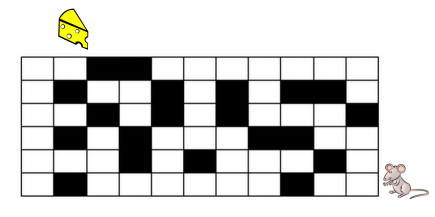

<dl>

<strong>
UNIVERSIDADE ESTADUAL DO PÍAUI 
CENTRO DE TECNOLOGIA E URBANISMO 
CIENCIA DA COMPUTAÇÃO 
Prof. Marvin Lemos 

2018-2

</strong>

</dl>

### TRABALHO I – BUSCA EM LARGURA
**por Lucas Pinheiro de Oliveira**

---

#### 1. DESCRIÇÃO

Ajude um rato a encontrar um pedaço de queijo num labirinto como o do
desenho abaixo:

Um labirinto desses pode ser representado por uma matriz retangular \[L\],
cujo elemento �#$ vale 0 ou −1 conforme a casa correspondente do labirinto
seja uma passagem livre ou uma parede, respectivamente.
O labirinto (de tamanho � � �) deve ser criado dinamicamente por meio
da leitura de um arquivo texto. O arquivo deve conter exatamente � linhas por
� colunas de números inteiros, com valor 0 ou −1 para indicar espaço livre ou
não (respectivamente) no labirinto.
O objetivo do trabalho é desenvolver um programa, baseado na Busca
em Largura, para, a partir de um ponto inicial, encontrar o menor caminho que
o rato deve seguir até alcançar o queijo.

### 2. FUNCIONALIDADES

* a. O programa deve permitir que o usuário possa carregar um novo
arquivo de configuração de labirinto antes de executar a busca;

* b. O programa deve solicitar a definição da posição inicial do rato, bem
como da localização do queijo.

### 3. REQUISITOS NÃO FUNCIONAIS

* a. Além da implementação do algoritmo de busca, o programa deverá
conter um módulo de interface com o usuário, para exibir uma
animação correspondente à solução encontrada. Existem boas
bibliotecas disponíveis para a maioria das linguagens, como a
PyGame (Python), Allegro (C/C++), JMonkeyEngine (Java), Unity
(C#), dentre outros.

No casso desta aplicação foi utilizado Python com PyQt4